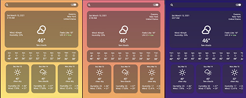
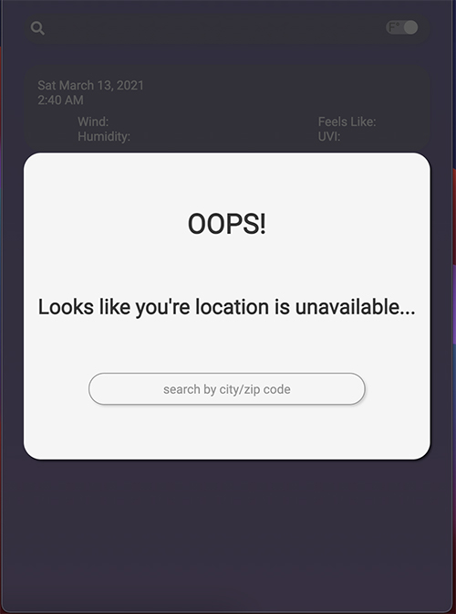
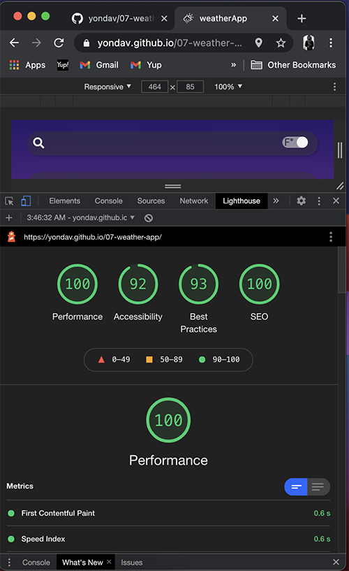

# 07-weather-app

[](https://opensource.org/licenses/MIT)

This weather app provides the weather of the user's current location on load and also provides a search field to check weather in other locations. The app offers the current forecast, hourly forecast for 24 hours and daily forecast for the upcoming week.

## Deployed Webpage

https://yondav.github.io/07-weather-app/

### Interactive Design


Interactive design using pure CSS.

- I had a lot of fun designing this website and furthering my knowledge of flex-box. Weather icons designed by <a href="https://erikflowers.github.io/weather-icons/">Erik Flowers</a>.

### Color Scheme Based On Time Of Day



- Three color schemes based on time of day.

## Temperature Unit Toggle, Save Recent Searches


- Search by city or zip code. Recent searches are automatically saved for easy access. User has option to clear local storage.
- Imperial and Metric units available by toggle in the nav-bar.

## Modal



- If the user is not sharing their location and the current location's forecast can't be retrieved, user will be prompted to input a location.

## MVP

```
GIVEN a weather dashboard with form inputs
WHEN I search for a city
THEN I am presented with current and future conditions for that city and that city is added to the search history
WHEN I view current weather conditions for that city
THEN I am presented with the city name, the date, an icon representation of weather conditions, the temperature, the humidity, the wind speed, and the UV index
WHEN I view the UV index
THEN I am presented with a color that indicates whether the conditions are favorable, moderate, or severe
WHEN I view future weather conditions for that city
THEN I am presented with a 5-day forecast that displays the date, an icon representation of weather conditions, the temperature, and the humidity
WHEN I click on a city in the search history
THEN I am again presented with current and future conditions for that city
```

## My Approach

I wanted to challenge myself a bit to use an additional api and to use data points from the two to achieve a more robust weather app. I chose not to use a CSS framework for the layout and overall design though the icon libraries provided by - <a href="https://fontawesome.com//">Font Awesome</a> and <a href="https://erikflowers.github.io/weather-icons/">Erik Flowers</a> helped to complete the design.



### Made with...

- <a href="https://openweathermap.org/api">Open Weather Map API</a>
- <a href="https://docs.mapbox.com/api/overview/">Mapbox API</a>
- <a href="https://fontawesome.com//">Font Awesome</a>
- <a href="https://momentjs.com/">Moment</a>

Copyright (c) [2021] [Jonathan David]
